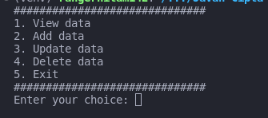

# Simple CRUD API in Python  
This repository is consists of 2 different program, CLI CRUD (Create, Read, Update and Delete) and simple API CRUD using Python, PostgreSQL, and FastAPI.

## Dependencies
- `os`
- `dotenv`
- `fastapi`
- `uvicorn`
- `psycopg2`

## How to run
- Create a PostgreSQL database
- Create a table named `person` in your PostgreSQL database. with the column:
    - `id`: int not null primary key
    - `nama`: varchar(100) not null
    - `jenis_kelamin`: char(1) not null
    - `id_orangtua`: int  
or just simply run this sql script  
```
create table person (
	id int not null primary key,
	nama varchar(100) not null,
	jenis_kelamin char(1) not null,
	id_orangtua int
);
```
- Create `.env` to store environment variable in root project folder:
```
DATABASE=your database name
HOST=localhost
USER=user database
PASSWORD=user password
PORT=database port
```
- Install dependencies by running `pip install -r requirements.txt`  
### CRUD CLI
- run `python3 crud/main.py` on your console  


### API
- run `cd api`
- run `uvicorn main:app --reload`
- import `Test.postman_collection.json` to postman
- play around in the postman to test our API
- See generated documentation here `http://127.0.0.1:8000/docs#/`